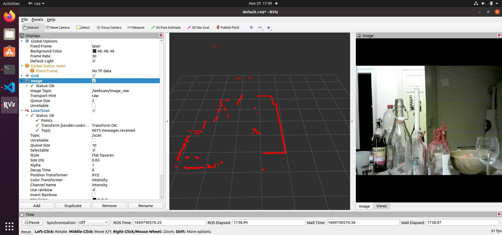
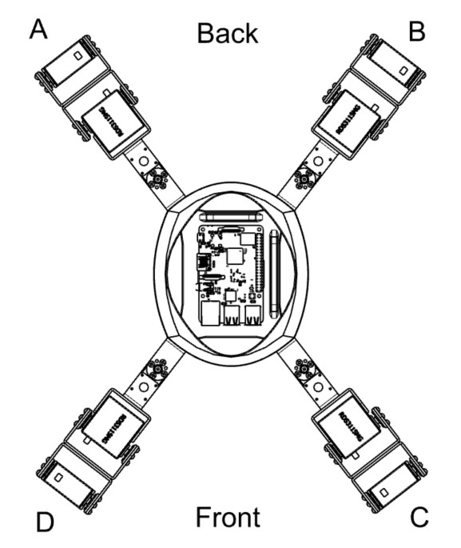
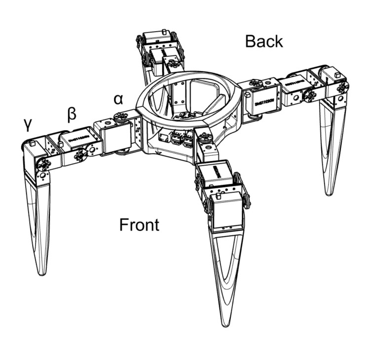

# ROS_Quadruped

Repository to control a Quadruped Robot via ROS Noetic on a Raspberry Pi.

|:--:|
|<b>Crawl Pattern</b>|


>**Note:**
>This Repository is a work in progress and serves as a place to take notes, it is not intended to be cloned. Readability and structure of the code need to be improved. However if you are interested in the project and have questions, don't hesitate to contact me.


## 1. Main Hardware Components
- Raspberry Pi 3B+ (https://www.raspberrypi.com/products/raspberry-pi-3-model-b-plus/)
- RDS3225 Servos (or similar) 
- Adafruits PCA9685 Servo Driver (https://www.adafruit.com/product/815)
- Slamtec RPLidar A1 (https://www.slamtec.com/en/Lidar/A1)
- Batterypack 7.2V (Powersupply Servos)
- Waveshare UPS HAT (Powersupply RPi, https://www.waveshare.com/wiki/UPS_HAT)

## 2. Set up
1. Flash Ubuntu 20.04 on SD and run on RPi
2. Install ROS Noetic
3. Clone Repo: `git clone <ROS_Quadruped>` 
4. Navigate to ROS_Quadruped/catkin_ws and make: `catkin_make -j2`  
5. Navigate to ROS_Quadruped/catkin_ws/src  
6. Clone Repo: https://github.com/ros-drivers/video_stream_opencv
7. Clone Repo: https://github.com/Slamtec/rplidar_ros/tree/b1df5d7695b20a3e595ad6c47e3dd44f983e1227
8. Navigate to ROS_Quadruped/catkin_ws and make: `catkin_make -j1`
9. Navigate to ROS_Quadruped/catkin_ws/src/video_stream_opencv/launch
10. Reduce webcam fps to make robot faster:  
    Edit `webcam.launch`:  
    `<arg name="set_camera_fps" value="20"/>`  
    `<arg name="fps" value="20" />`  
    

## 3. Ros Packages

### 3.1 quad_pkg
Imported by hw_motion_main.py to calculate angles for each Leg.
#### 3.1.1 config.py
Contains shared objects which are used in multiple files and a setup function for I2C- and PCA Objects (I2C: Communication protocol between RPi & Servo driver, PCA: Servo driver).
(To Do: define geometry constats which are currently defined in hw_ctrl/hw_motion_main.py)
#### 3.1.2 motion.py
Contains class "Leg" and "Quadruped" which are used to compute the angles of each joint of every leg. 
##### Leg methods:
- Vectorgeometry to calculate angles of joints.
##### Quadruped methods:
- Combine and coordinate Legs of Robot
- Movement patterns

### 3.2 rplidar_ros
The Lidar is used to detect obstacles around the Robot. The information gained from the Lidar is published by rplidar_ros/node.cpp to /scan. Slamtec provides a ROS package to drive their RPLidar A1. (https://github.com/Slamtec/rplidar_ros)

|:--:|
|<b>Obstacle avoidance with Lidar (sped up)</b>|

### 3.3 motion_planning
motion_planning_main.cpp subscribes to /scan from Lidar, processes the received information to avoid obstacles and publishes to /direction. Default direction is forward.

### 3.4 hw_ctrl
hw_motion_main.py subscribes to /direction and uses quad_pkg to control the physical Legs and move the Robot towards the desired direction. 
(To Do: move geometry constants to quad_pkg/config.py)

### 3.5 video_stream_opencv
The webcam images are published to webcam/image_raw via video_stream_opencv, a package to drive webcams with opencv: https://github.com/ros-drivers/video_stream_opencv

## 4. Startup Procedure 
1. start mobile hotspot
2. start RPi
3. check IP of RPi in hotspot settings (usually `192.168.150.113`)
4. shh into RPi from local machine: `ssh pi@<IP>` (usually `ssh pi@192.168.150.113`) 

##### on remote machine:
(Step 1 - 3 are usually defined and executed by `~/.bashrc`)
1. set ROS_IP:            `export ROS_IP=<IP>`)
2. set ROS_URI:           `export ROS_MASTER_URI=http://<IP>:11311`)
3. source all Terminals:  `source ~/Projects/ROS_Quadruped/catkin_ws/devel/setup.bash`)
4. start master:          `roscore`
5. launch lidar:          `roslaunch rplidar_ros rplidar.launch`
6. launch webcam          `roslaunch video_stream_opencv webcam.launch`
7. run motion_planning:   `rosrun motion_planning motion_planning_main`
8. run hw_ctrl:           `rosrun hw_ctrl hw_motion_main.py`

### 4.1 View Data in Rviz

|:--:|
|<b>Rviz</b>|

##### on local machine:
1. set ROS_MASTER_URI:  `export ROS_MASTER_URI=http://<remote IP>:11311`
2. set ROS_IP:          `export ROS_IP=192.168.178.111`
3. test connection:     `rostopic list`
4. start rviz:          `rviz rviz`
5. Add Image:           "Add" > "Image"  
   subscribe to topic:  "Image" > "Image Topic" > "/webcam/image_raw"
5. Add LaserScan:       "Add" > "LaserScan"  
   subscribe to topic:  "LaserScan" > "Topic" > "/scan"  
   change fixed frame:  "Global Options" > "Fixed Frame" > "/laser"

## 5. Mechanics and Geometry

|:--:|
|<b>Top View</b>|


|:--:|
|<b>Perspective View</b>|

## 6. Wiring

Connect Servos to Servo Driver:
```     
        config.kit.servo[2].angle = limitAngle(self.legA.alphaCorr, minAngle, maxAngle)
        config.kit.servo[3].angle = limitAngle(self.legA.betaCorr, minAngle, maxAngle)
        config.kit.servo[4].angle = limitAngle(self.legA.gammaCorr, minAngle, maxAngle)

        config.kit.servo[5].angle = limitAngle(self.legB.alphaCorr, minAngle, maxAngle)
        config.kit.servo[6].angle = limitAngle(self.legB.betaCorr, minAngle, maxAngle)
        config.kit.servo[7].angle = limitAngle(self.legB.gammaCorr, minAngle, maxAngle)

        config.kit.servo[8].angle = limitAngle(self.legC.alphaCorr, minAngle, maxAngle)
        config.kit.servo[9].angle = limitAngle(self.legC.betaCorr, minAngle, maxAngle)
        config.kit.servo[10].angle = limitAngle(self.legC.gammaCorr, minAngle, maxAngle)

        config.kit.servo[11].angle = limitAngle(self.legD.alphaCorr, minAngle, maxAngle)
        config.kit.servo[12].angle = limitAngle(self.legD.betaCorr, minAngle, maxAngle)
        config.kit.servo[13].angle = limitAngle(self.legD.gammaCorr, minAngle, maxAngle)
```
